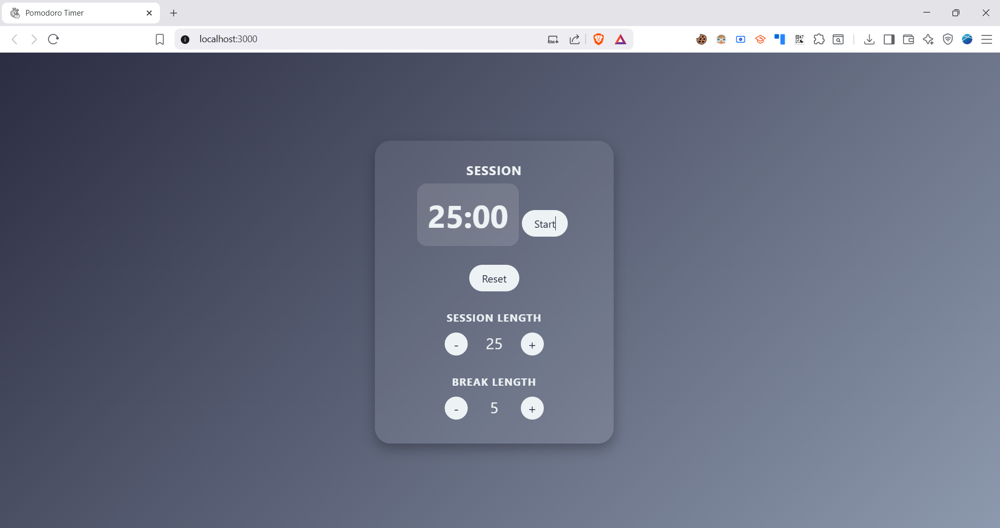

<p align="center">
  <a href="https://pomodoro-clock-your-deploy.vercel.app/" target="_blank">
    
  </a>
</p>

<h1 align="center">Pomodoro Clock</h1>

<p align="center">
  <a href="https://pomodoro-clock-your-deploy.vercel.app/" target="_blank">Live Demo</a> •
  <a href="#project-description">Project Description</a> •
  <a href="#features">Features</a> •
  <a href="#tech-stack">Tech Stack</a> •
  <a href="#installation">Installation</a> •
  <a href="#usage">Usage</a> •
  <a href="#credits">Credits</a>
</p>



---

## Project Description

**Pomodoro Clock** is a productivity-focused web application based on the [Pomodoro Technique](https://en.wikipedia.org/wiki/Pomodoro_Technique).  
It allows users to manage work sessions and breaks with a customizable timer.

Built with **React** and **useReducer**, it demonstrates state management, side effects with hooks, and responsive UI design.

🔗 [Live Demo](https://pomodoro-clock-your-deploy.vercel.app/)

---

## Features

- Adjustable session and break lengths (1–60 minutes)
- Start, stop, and reset controls
- Automatic switch between work (session) and rest (break)
- Audio notification when the timer reaches zero
- Responsive layout for desktop and mobile screens

---

## Tech Stack

- **Frontend**: React (Hooks, useReducer)
- **Styling**: CSS
- **Deployment**: Vercel

---

## Installation

```bash
git clone https://github.com/nca-gabriel/pomodoro-clock.git
cd pomodoro-clock
npm install
```

---

## Usage Start the development server:

bash
npm run dev

## Credits - [Pomodoro technique icon](https://www.flaticon.com/free-icon/pomodoro-technique_14359179) created by [Iconjam](https://www.flaticon.com/authors/iconjam) — [Flaticon](https://www.flaticon.com/)
